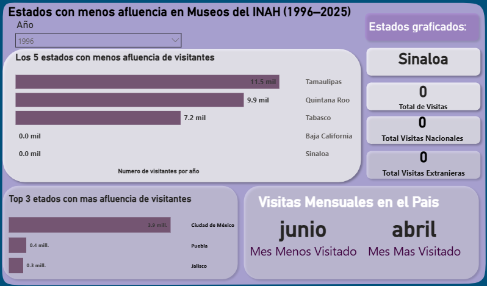
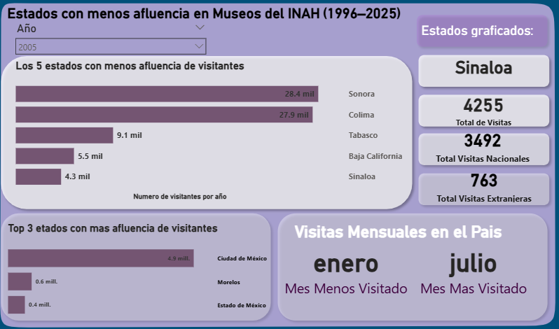
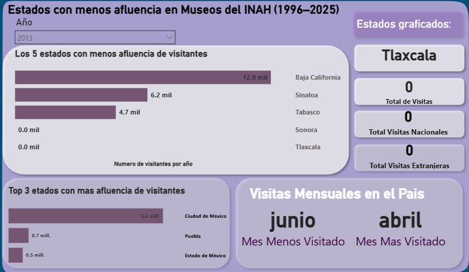
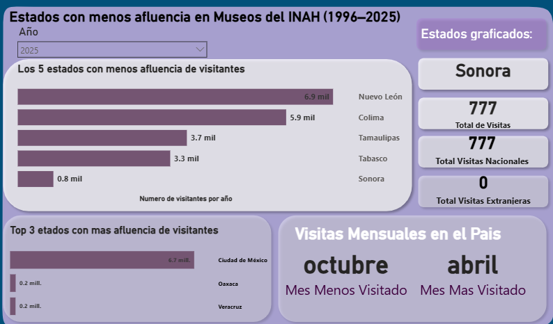

# Analisis-de-Afluencia-en-Museos-del-INAH-1996-2025-SQL-Power-BI
Ejemplos de las posibles pantallas por año (1996-2025)
### 1996

### 2005

### 2013

### 20205

📁 Descripción del Proyecto
Este proyecto analiza la afluencia histórica de visitantes a los museos administrados por el INAH (Instituto Nacional de Antropología e Historia) en México.
Los datos empleados son reales, extraídos del portal oficial de datos abiertos del Gobierno de México:

🔗 Fuente oficial del dataset:
https://datos.gob.mx/dataset/visitantes_museos_abiertos_publico/resource/f68304f4-844b-41c0-bde5-cf22a4b2e4c1

El objetivo principal del proyecto es:

-Identificar los estados con menor afluencia de visitantes por año.
-Mostrar tendencias nacionales mensuales de visitas (mes más visitado y menos visitado).
-Obtener los tres estados con mayor afluencia (ranking superior).
-Construir un dashboard interactivo y ordenado para exploración de datos.

🧾 Tecnologías utilizadas
**Herramienta	**                **Uso en el proyecto**
PostgreSQL	            Limpieza, preparación de datos, creación de tablas, cálculos y consultas analíticas.
Power BI	              Dashboard final interactivo.
PowerPoint	            Diseño de la plantilla visual utilizada como fondo para Power BI.

🗂️ Dataset y particularidades
[Ver Dataset](./Visitantes_museos_publicos_INAH.csv)

El dataset contiene información del número de visitantes nacionales y extranjeros por museo, clasificados por:

-Estado

-Año

-Mes

-Tipo de visitante (nacional / extranjero)

-Clave SIINAH del museo

-Nombre del recinto

🔎 Nota importante sobre los datos:
Durango es el único estado del país que aparece sin registros en el dataset.
Esto no es un error del análisis, sino una ausencia real en los datos oficiales.

📌 KPIs principales obtenidos

🔻 Estado con menos visitas por año

🔺 Estado con más visitas por año

🔻 Mes menos visitado del país por año

🔺 Mes más visitado del país por año

📈 Total de visitas nacionales y extranjeras por estado

🥇 Ranking top 3 de estados con mayor afluencia

--

📊 Dashboard en Power BI

El dashboard incluye:

-Segmentador por año

-Gráfica de los 5 estados con menor afluencia

-Gráfica de los 3 estados con mayor afluencia

-KPIs del estado menos visitado

-KPIs nacionales (mes más visitado y mes menos visitado)

Diseño estandarizado usando una plantilla visual elaborada en PowerPoint

📌 Conclusiones del análisis

La afluencia varía fuertemente entre estados:
Ciudad de México domina en visitas, mientras que estados como Sonora, Tabasco o Tamaulipas suelen aparecer entre los menos visitados.
Durango no presenta registros en todo el dataset (1996–2025).

A nivel nacional, ciertos meses tienen picos históricos como marzo (vacaciones) y caídas importantes como junio.
